# NCHC Agentic AI Bootcamp — 完整環境建置手冊

> **閱讀說明**：本文件為自給自足的操作手冊，所有指令與設定檔內容皆內嵌於此。
> 在一台全新的 Linux VM（GPU：NVIDIA H200）上，依序執行各步驟即可完成環境建置。

---

## 前置作業｜在 NCHC 雲平台建立 VM

> 平台網址：[https://ai-cloud.iic.nchc.org.tw/](https://ai-cloud.iic.nchc.org.tw/)

### NCHC-1. 登入平台

前往 [https://ai-cloud.iic.nchc.org.tw/](https://ai-cloud.iic.nchc.org.tw/) 登入，確認專案名稱為 **NCHC-NVIDIA Joint Lab 教育訓練**（專案 ID：GOV114072）。


### NCHC-2. 建立安全群組

在首頁（如 NCHC-1 截圖）服務區塊中，點擊 **「安全群組」**，進入「安全群組管理」頁面，點擊 **「+ 建立」**。

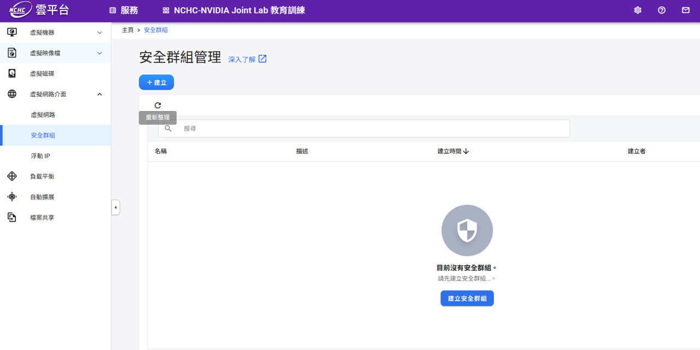

進入「建立安全群組」頁面，**名稱**欄位保留預設值（例如 `sg1772642623211`），點擊 **「下一步：規則設定 >」**。


進入規則設定頁面，預設已有一條 `egress ipv4` 規則。

點擊 **「新增安全群組規則」**。


新增 **SSH（port 22）** 規則，欄位填寫如下：

| 欄位 | 填寫內容 |
|------|---------|
| 方向 | `ingress` |
| 連接埠範圍（最小）| `22` |
| 連接埠範圍（最大）| `22` |
| 協定 | `tcp` |
| CIDR | 填入當下使用者的 IP（見下方說明） |

新增 **Jupyter（port 8888）** 規則，欄位填寫如下：

| 欄位 | 填寫內容 |
|------|---------|
| 方向 | `ingress` |
| 連接埠範圍（最小）| `8888` |
| 連接埠範圍（最大）| `8888` |
| 協定 | `tcp` |
| CIDR | 填入當下使用者的 IP（見下方說明） |

> **如何取得 CIDR？**
> 1. 前往 [https://www.whatismyip.com.tw/en/](https://www.whatismyip.com.tw/en/) 查詢目前的公開 IP（例如 `123.123.123.45`）
> 2. 若只允許單一 IP 連線：填入 `123.123.123.45/32`
> 3. 若允許整個網段（例如辦公室 IP 範圍）：填入 `123.123.123.0/24`

新增 **ingress** 規則，欄位填寫如下：

| 欄位 | 填寫內容 |
|------|---------|
| 方向 | `ingress` |
| 連接埠範圍（最小）| `1` |
| 連接埠範圍（最大）| `65535` |
| 協定 | `any` |
| CIDR | 10.1.1.0/24 |

填寫完成後點擊 **「確定」**。

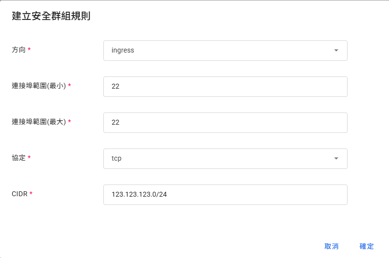

規則新增完成後，清單中應出現 `egress`, `ingress`, `ingress port 22` 與 `ingress port 8888` 四條規則。確認後點擊 **「下一步：檢閱+建立 >」**。


確認名稱與規則（egress + ingress port 22）無誤後，點擊左下角 **「建立」**。

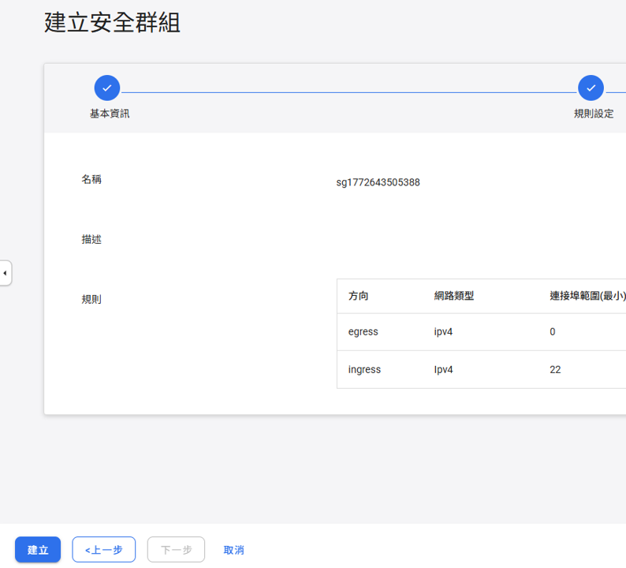

安全群組建立完成。

### NCHC-3. 進入虛擬機器管理頁面

在左側選單點擊 **虛擬機器 → 虛擬機器管理**，進入管理頁面後點擊 **「+ 建立」**。


### NCHC-4. 基本設定

進入「建立虛擬機器」頁面，共分六步驟：**基本設定 → 硬體設定 → 虛擬網路 → 儲存資訊 → 認證 → 初始化指令**。

**基本設定**欄位填寫如下：

| 欄位 | 填寫內容 |
|------|---------|
| 名稱 | 自訂（例如 `vm1772640765`） |
| 描述 | （選填） |
| 映像檔來源 | 點擊「選擇」→ 選擇 **Ubuntu** |
| 映像檔標籤 | **24.04** |

填寫完成後，確認如圖所示，點擊 **「下一步：硬體設定 >」**。


### NCHC-5. 硬體設定

選擇型號 **`GPU.small`**，點擊 **「下一步：虛擬網路 >」**。

| 型號 | GPU 型號 | GPU（張）| CPU（Cores）| 記憶體（GiB）| 開機磁碟（GiB）|
|------|---------|---------|------------|------------|--------------|
| GPU.large | H200 | 2 | 192 | 1024 | 120 |
| **GPU.small** ✅ | **H200** | **1** | **96** | **512** | **120** |
| CPU.medium | - | 0 | 16 | 32 | 120 |

> **為何選 GPU.small？** PhysicsNeMo 需要 NVIDIA H200 GPU（建議 ≥ 20 GB VRAM）、≥ 32 GB RAM、Ubuntu 22.04+、可連外網路。GPU.small 提供 H200 × 1、512 GiB RAM、Ubuntu 24.04，完全符合需求。

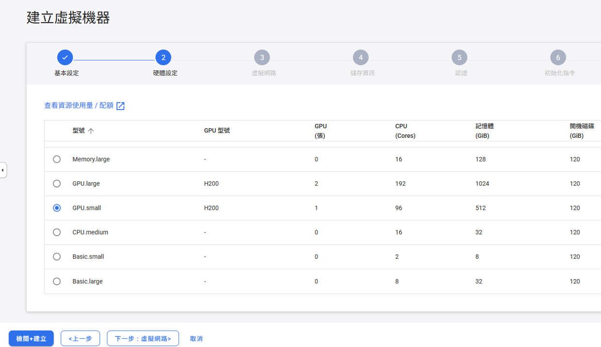

### NCHC-6. 虛擬網路設定

進入「虛擬網路」步驟，清單顯示 `No data available`，需至少新增一張虛擬網卡。點擊 **「新增虛擬網卡」**。

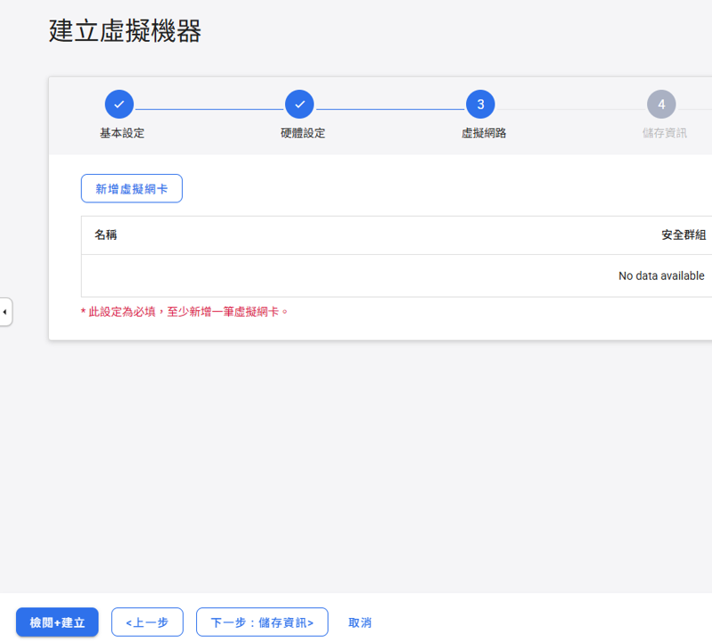

在「新增虛擬網卡」對話框中填寫：

| 欄位 | 填寫內容 |
|------|---------|
| 虛擬網路 | `bootcamp` |
| 安全群組 | 選擇剛才建立的安全群組（例如 `sg1772643505388`） |

填寫完成後點擊 **「確定」**。

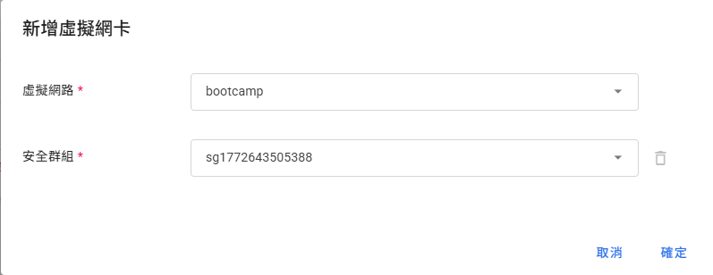

確認清單出現 `bootcamp` 網路及對應安全群組後，點擊 **「下一步：儲存資訊 >」**。


### NCHC-7. 儲存資訊（建立虛擬磁碟）

進入「儲存資訊」步驟，點擊 **「建立虛擬磁碟」**。


在「建立虛擬磁碟」對話框中填寫：

| 欄位 | 填寫內容 |
|------|---------|
| 名稱 | 保留預設（例如 `vol1772681329`） |
| 描述 | （選填） |
| 容量（GiB） | **50** |
| 類型 | `SSD` |

填寫完成後點擊 **「確定」**。

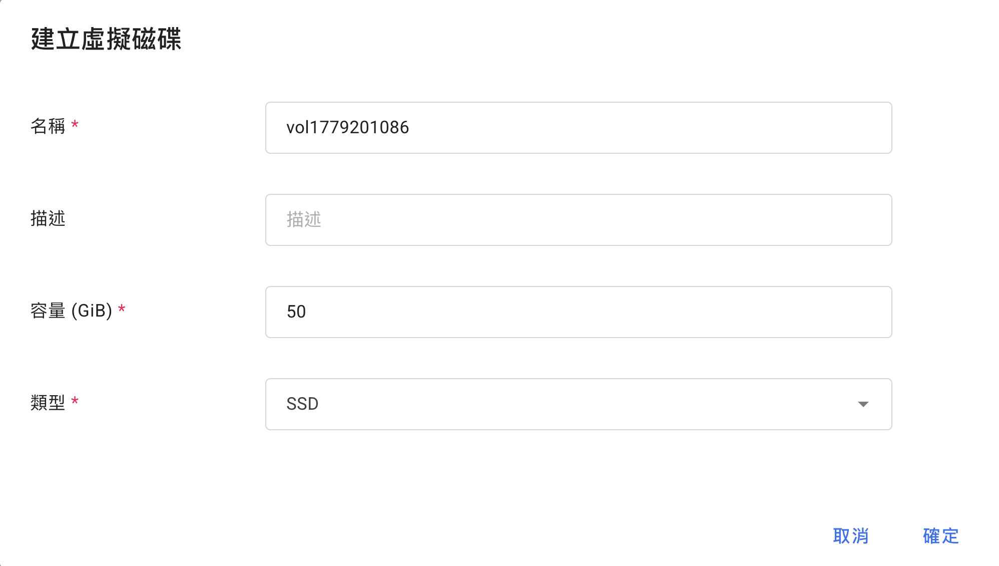

確認清單出現磁碟名稱與容量（100 GiB）後，點擊 **「下一步：認證 >」**。


### NCHC-8. 認證設定

進入「認證」步驟：

| 欄位 | 填寫內容 |
|------|---------|
| 鑰匙對認證 | **停用** |
| 密碼 | `NCHCbootcamp2026_` |

> ⚠️ **請務必記住此密碼**，後續 SSH 連線至 VM 時會需要輸入。

密碼設定完成後，點擊 **「下一步：初始化指令 >」**。

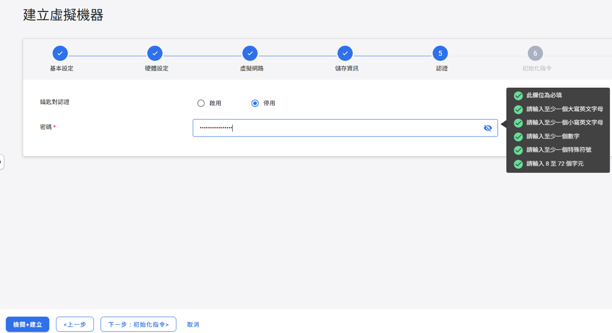

### NCHC-9. 初始化指令

「初始化指令」欄位保留空白，直接點擊 **「下一步：檢閱+建立 >」**。


### NCHC-10. 檢閱並建立 VM

進入最後的「檢閱+建立」步驟，確認以下設定無誤：

| 項目 | 確認內容 |
|------|---------|
| 名稱 | `vm...`（自動產生） |
| 映像檔來源 | `Ubuntu` |
| 映像檔標籤 | `24.04` |
| 硬體設定 | `GPU.small` |
| 虛擬網路 | `bootcamp` + 安全群組 |

確認後點擊左下角 **「建立」**。

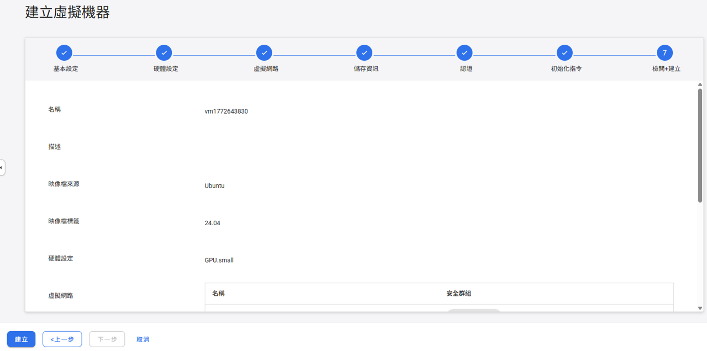

### NCHC-11. 等待 VM 啟動並取得 IP

建立後回到「虛擬機器管理」頁面，等待數分鐘，狀態由 `build` 變為 **`active`** 即表示 VM 已就緒。

點擊 VM 名稱進入詳細頁面，後續步驟將在此取得**浮動 IP**。

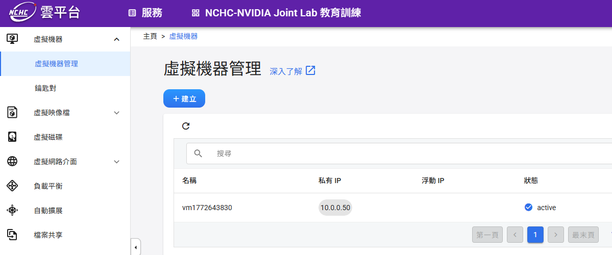

進入 VM 詳細資料頁面，確認：
- **狀態**：`active`
- **登入帳號**：`ubuntu`

在「虛擬網路資訊」區塊中，點擊 `bootcamp` 列右側的 **「⋮」** 按鈕，選擇 **「配置浮動 IP」**。

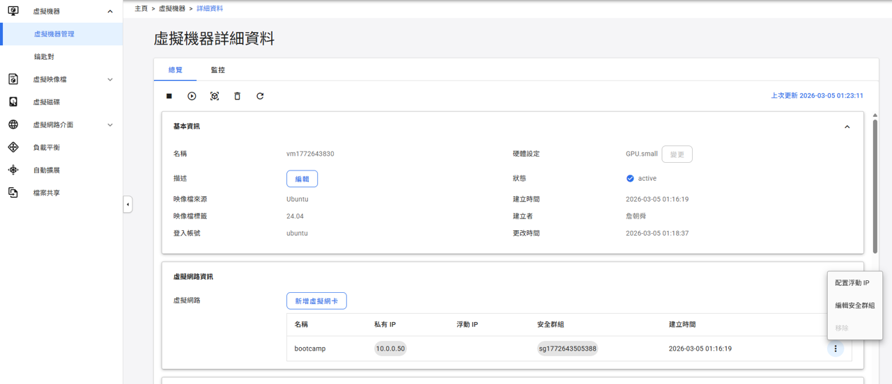

在「配置浮動 IP」對話框中選擇 **「自動配置浮動 IP」**，點擊 **「確定」**。


配置完成後，虛擬網路資訊欄位會顯示 **浮動 IP**（例如 `140.110.108.39`），此即為從外部 SSH 連線時使用的 IP。

> ⚠️ **請記下或複製此浮動 IP**，下一步 SSH 連線時會需要用到。


### NCHC-12. SSH 連線至 VM

**先在本機開啟 Terminal：**

| 平台 | 開啟方式 |
|------|---------|
| **Windows** | 開始選單搜尋 `PowerShell` 或 `cmd`，或安裝 [Windows Terminal](https://aka.ms/terminal) |
| **macOS** | `Spotlight`（`⌘ + Space`）搜尋 `Terminal`，或至「應用程式 → 工具程式 → 終端機」 |
| **Linux** | 快捷鍵 `Ctrl + Alt + T`，或在應用程式選單中搜尋 `Terminal` |

> Windows 10/11 內建的 PowerShell 與 cmd 均支援 `ssh` 指令，無需額外安裝。

使用浮動 IP 從本機連線至 VM：

```bash
ssh ubuntu@<浮動IP>
```

例如：

```bash
ssh ubuntu@140.110.108.39
```

輸入建立 VM 時設定的**密碼**即可登入。

> 密碼：`NCHCbootcamp2026_`


## 步驟 1｜下載本教學素材

```bash
git clone https://github.com/cl-chiu/NCHC-Agentic-AI-Bootcamp-2026.git
```

---

## 步驟 2｜執行安裝腳本

```bash
cd NCHC-Agentic-AI-Bootcamp-2026

sudo bash setup.sh
```

> 安裝完成後，會自動重開機
> 重開機後 VM 需要約 **1–2 分鐘**才會重新接受 SSH 連線，請稍候再重新登入。
> 登入密碼：`NCHCbootcamp2026_`

## 步驟 3 | 重開機後確認 Driver 安裝成功

```bash
nvidia-smi
```

預期輸出範例：

```
+-----------------------------------------------------------------------------------------+
| NVIDIA-SMI 570.211.01             Driver Version: 570.211.01     CUDA Version: 12.8     |
|-----------------------------------------+------------------------+----------------------+
| GPU  Name                 Persistence-M | Bus-Id          Disp.A | Volatile Uncorr. ECC |
| Fan  Temp   Perf          Pwr:Usage/Cap |           Memory-Usage | GPU-Util  Compute M. |
|=========================================+========================+======================|
|   0  NVIDIA H200 NVL                Off |   00000000:06:00.0 Off |                    0 |
| N/A   33C    P0             69W /  600W |       0MiB / 143771MiB |      0%      Default |
+-----------------------------------------+------------------------+----------------------+
```


## 關閉 VM（課程結束後）

> ⚠️ **執行前請確認**：不再需要保留此 VM。**刪除後無法復原。**

課程結束後，回到 NCHC 雲平台的**虛擬機器管理**頁面，找到對應的 VM。

點擊該欄位最右側的 **「⋮」** 按鈕，選擇 **「刪除」**，即可永久移除此 VM 並停止計費。

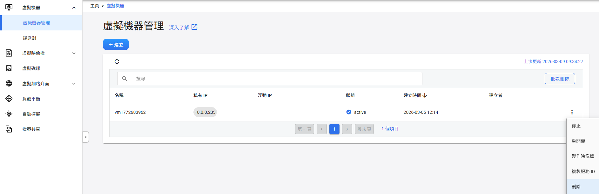

---


## 疑難排解

### GPU 無法在容器內存取

**錯誤訊息**：`could not select device driver "nvidia" with capabilities: [[gpu]]`

```bash
sudo nvidia-ctk runtime configure --runtime=docker
sudo systemctl restart docker
```

---

### 容器啟動失敗：Driver Not Loaded

**錯誤訊息**：`failed to initialize NVML: Driver Not Loaded`

VM 連線中斷後恢復可能導致 NVIDIA kernel module 未載入。

**方法一**：重新載入 module（最快）

```bash
sudo modprobe nvidia
sudo systemctl restart docker
docker start physicsnemo-bootcamp
```

**方法二**：若出現 `Module nvidia not found in directory /lib/modules/<kernel>`，代表當前 kernel 缺少對應的 module，需重新編譯：

```bash
# 安裝當前 kernel headers
sudo apt-get install linux-headers-$(uname -r)

# 觸發 DKMS 為當前 kernel 重新編譯 module
sudo dkms autoinstall

# 重啟 Docker 並啟動容器
sudo systemctl restart docker
docker start physicsnemo-bootcamp
```

**方法三**：若 DKMS 失敗，重裝 Driver（最穩定）：

```bash
sudo apt-get install --reinstall nvidia-driver-570
sudo reboot
# 重開機後重新 SSH 登入
docker start physicsnemo-bootcamp
```

---

### Driver 版本不匹配

**錯誤訊息**：`Failed to initialize NVML: Driver/library version mismatch`

```bash
sudo reboot
```

---

### 無法 pull base image（unauthorized）

**錯誤訊息**：`unauthorized: authentication required`

NGC 公開 Catalog image 偶爾會更新版本，舊版仍可直接 pull，新版若遇到此錯誤，
可至 [NGC Catalog](https://catalog.ngc.nvidia.com/orgs/nvidia/teams/physicsnemo/containers/physicsnemo)
確認仍公開的 tag，或免費註冊 NGC 帳號後執行：

```bash
docker login nvcr.io -u '$oauthtoken' -p <YOUR_NGC_API_KEY>
```

---

### JupyterLab 無法從外部存取

```bash
# Ubuntu ufw 防火牆
sudo ufw allow 8888/tcp
sudo ufw reload
sudo ufw status
```

Cloud VM 請在 Security Group / Firewall Rules 中開放 TCP port 8888 inbound。

---

### 容器記憶體不足（OOM）

確認 `docker run` 指令包含以下參數：

```bash
--ipc=host
--ulimit memlock=-1
--ulimit stack=67108864
```
